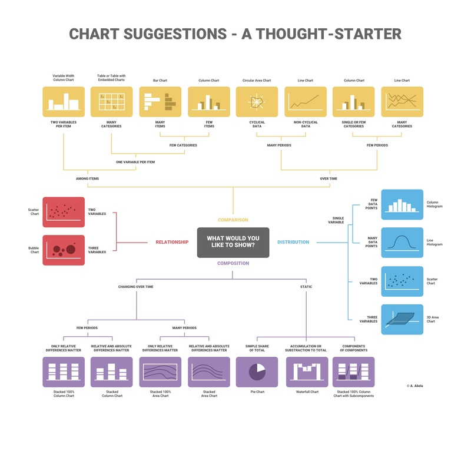

+++
title = "Choosing a Chart Style"
date = 2024-03-11T13:58:38-05:00
draft = false
weight = 2
+++

When it comes to visualizing data, picking the correct chart style is key to an effective visualization. However, analysts have so many different chart styles at their disposal that it can be overwhelming to find the right one for the situation at hand. Chart styles fall into four main groupings:

1. Comparison
1. Relationship
1. Distribution
1. Composition

**Comparison charts** are charts designed specifically to show how two or more sets of datapoints differ from each other. You might want to use one of these charts if you are looking at the depreciation in car value between different car manufacturer's midsized SUVs. 

**Relationship charts** help us pinpoint the correlation between our datapoints. You would need one of these charts if you want to plot out the number of reviews an item has received on a shopping site versus the amount of time the item has been on the site.

**Distribution charts** are used to demonstrate how data is spread out, usually over a time period. If you wanted to visualize the bat population in Mammoth Caves National Park, you would need a distribution chart.

**Composition charts** show us the breakdown of the data across categories. If you are putting together a visualization for a monthly budget showing how much is allocated for each category, you would need a composition chart.

Once you figure out what category of chart you need, then you can dive deeper into finding the right chart style. Below is a map showing what questions you might ask yourself once you have settled on the correct chart category.


   <figure>
      
      <figcaption>Image courtesy of Infogram: https://infogram.com/blog/choose-the-right-chart/#:~:text=Selecting%20the%20right%20chart%20type,display%20parts%20of%20a%20whole. </figcaption>
   </figure>


For now, we just want you to focus in on practicing making visualizations, trying out different chart styles, and developing your thought process around making an effective visualization. You do not need to memorize all the different chart styles at this time.

Let's dive deeper into a few of the chart styles that you may recognize from earlier chapters in this book.

## Bar Charts and Column Charts

Bar charts and column charts both fall into the category of comparison charts. A bar chart has the categories on the y-axis, so the bars are horizontal, whereas a column chart has the categories on the x-axis so the bars are vertical. While the difference in orientation might seem minor, it can make a huge difference in the readability of the chart. For example, if the categories have very long names or there are a lot of categories, your colleagues might find it easier to read those labels if the labels are displayed on the y-axis as opposed to the x-axis. Don't hesitate to switch between a column and a bar chart to find something that looks nice to you!

You want to be mindful of using a stacked column chart though because that falls into the category of composition charts. 

## Scatterplots

Scatterplots are relationship plots. A scatterplot can help pinpoint what the relationship exactly is in a dataset. For example, we want to visualize the number of butterflies seen in an area and the number of gardeners signed up with a pollinator planting program. We might assume before we assemble our visualization that there is a relationship between the two so a scatterplot makes sense here. 

## Histogram

A histogram is a type of distribution chart that looks a little bit like a bar chart. The key with a distribution chart is that we are trying to understand how the data is distributed. Is the data spread out or is it tightly packed? Histograms are oftentimes used in EDA to shed light on oddities in summary statistics and it is because they are distribution charts. If we wanted to plot the daily butterfly population over the course of the summer, a histogram would be a great choice!

## Pie Charts

Pie charts are some of the most commonly-used composition charts. Pie charts show the composition of the data as pieces of a pie with the size of each piece representing the percentage of the whole. The larger the piece of the pie chart, the bigger that percentage is. Some people do not like pie charts because they feel that it is harder to percieve the difference in size between pie slices versus bars or columns. The more slices of the pie, the more you may want to try a different type of composition chart.

## Check Your Understanding

{}

Match each chart style to its purpose.

| Chart Style | Purpose |
|-------------|---------|
| Pie chart | Comparison |
| Scatterplot | Composition |
| Bar chart | Relationship |

{}

{}

What is a weakness of a pie chart?

{}

