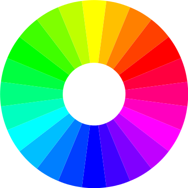

+++
title = "Best Practices for Data Visualization"
date = 2024-03-11T13:58:38-05:00
draft = false
weight = 1
+++

So far, we have shown quite a few visualizations. As much as visualizations are an integral part of EDA and cleaning data, they are also an integral part of conveying your findings to project stakeholders and other business leaders. 

We now need to focus in on what we should be doing when creating visualizations to present to our colleagues. While we want our presentations to stand out, our visualizations should also be effective without us having to be there to explain what is going on.

Since these visualizations are part of communicating our findings to our collaborators, even before we start choosing what chart we want to use, we can follow some best practices for all types of charts.

## Labeling Your Chart

No matter what chart style you choose, you need to properly label your charts. Labels include axes labels (X-axis, Y-axis, in rare instances Z-axis) and chart titles. Your labels should be clear and concise. 

Let's say that we work for a plant nursery and we want to visualize a tomato plant's growth over the course of six months. A poor chart title might be "Plant Growth". While accurate, since we are talking about a tomato plant, our colleagues at the nursery would not know it is a tomato plant unless you are present to explain. Keeping in mind that we want our visualizations to stand on their own, a better title would be "Tomato Plant Growth March 2024 - August 2024".

When it comes to labeling the axes, we want to make sure that we are clear and that we include units of measurement, if necessary. Let's assume we want to put the time on the x-axis and the height of the plant at that time on the y-axis. 

Before we start labeling our axes, we need to look at our data points for mapping the tomato plant's growth. Was a new measurement taken hourly, daily, weekly, or monthly? How is the data formatted? If it was daily, is the data in a date format, such as `03-16-2024`, or is it listed as number of days such as `15`? 

If we title the x-axis "Date", then our colleagues are going to have to study the x-axis much closer to figure out the answers to these questions. If we title it "Days of Growth Since 3/1/24", then our colleagues will be able to figure out that our data was measured in number of days as opposed to a date format and that the measurements were taken daily as opposed to the alternatives. 

Your colleagues should not have to study an axis of a visualization very closely to determine what is on that axis. The label should tell them what they are looking at. Furthermore, you may want to make adjustments to an axis so the points are legible and not all scrunched up and if you do, that may make it even harder for your colleagues to understand what is on that axis without a proper label.

With the x-axis labeled, we can turn our attention to the y-axis. We need to look at the data points again. 

What measurement system was used to measure the plant? If we plot out the points and label the y-axis, "Height of Central Stem", our colleagues will not know if the height was measured in inches, centimeters, feet, or meters. We need to make sure we add units to our labels so everyone understands what they are looking at. When adding units of measurements to an axis label, you include it in parantheses at the end of the label: "Height of Central Stem (in)".

## Time to Add Color!

Next, you want to pay attention to the colors you choose. Sometimes, you may find that the default color options are perfectly fine, but other times you may want to use colors from your company's branding. Colors should be contrasting. Look at a color wheel: is the color you want to use on the opposite side of the color wheel?

With your chart properly labelled, you can turn your attention to the colors used in your chart. In general, Google Sheets and Python libraries provide beautiful default color options for your visualization. However, during your career as an analyst, you may need to customize the color choices a bit. When you are working as an analyst, you may want to choose colors from your company's branding to ensure that your visualizations look sleek with the rest of your presentation. However, if you do not have a color palette provided for you, you may need to turn your attention to the color wheel.

Humans have been refining the color wheel for centuries, ever since Isaac Newton mapped out the first one. The color wheel can be a helpful reference when you find yourself having to pick out your own color scheme for visualizations. Since most visualizations will be presented on-screen, we are going to focus on the RGB color wheel. 


   <figure>
      
      <figcaption>Image courtesy of Wikipedia: https://en.m.wikipedia.org/wiki/File:RGB_color_wheel_24.svg</figcaption>
   </figure>


The RGB color wheel has three primary colors: red, green, and blue. The three **primary colors** are equidistant from each other on the color wheel. When picking three colors that go well together, choosing three colors that are equidistant from each other on the wheel is a pretty safe bet. 

You may notice that the colors of another popular color scheme in the world of tech (cyan, yellow, and magenta) are also equidistant from each other on the RGB color wheel. These three are the **secondary colors** on the color wheel and are made by mixing the three primary colors. When picking two colors that go well together, you can choose **complementary colors**, which are two colors that reside directly across from each other on the color wheel. 

In the case of the RGB color wheel, magenta and green are complementary colors and, as Lily Pulitzer has already demonstrated, those two colors look good together. You can find any number of wonderful combinations by using the color wheel.

## Keep It Simple!

Finally, you should make sure that you are not putting too much info on one chart. 

The more info on one chart, the harder it is for someone to read that one chart. If you are trying to map out multiple lines on one line chart, the chart might become difficult to read once you add the third line and will possibly become too busy once you add a fourth. While you may find yourself wanting to minimize the number of visualizations you make, you should not do so at the expense of your visualizations' readability. 

For example, imagine that you are trying to visualize all quiz scores over time for a third grade class of 30 students. If you wanted to map out each student's scores as one line on the chart, that would be 30 lines on one chart, making for a very busy chart! On the other hand, if you wanted to map out each student's scores as their own chart, you would need to make 30 charts, making a lot of work for you. 

However, if the teacher has already divided the class into 6 pods of 5 students, then it might make sense to make a chart for each pod with a line for each student.

By making sure that all your charts are properly labelled, that the colors are a good combination, and that you are making sure that it is not too busy, you are well on your way to making some beautiful visualizations. The only other best practice you want to follow when making visualizations is choosing the right chart style for the chart you are putting together. Let's dive into that next.