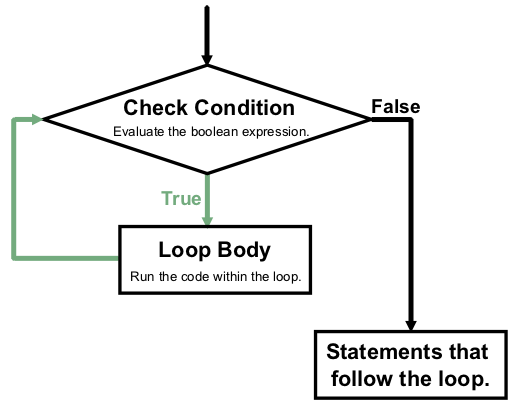

+++
title = "While Loops"
weight = 6
originalAuthorGitHub = "gildedgardenia"
+++

There is another Python keyword that can also be used for iteration---`while`.
Unlike a `for` loop, which defines a loop variable and a specific starting
and ending point, a **while loop** uses a single condition to determine whether
or not to continue running.

This condition controls the iteration. The body of a `while` loop repeats as long as the expression
evaluates to `True`.

## While Loop Syntax

The general syntax of a `while` loop looks like this:

```console
while boolean expression:
   loop body
```

A `while` loop continues to repeat as long as the boolean expression
evaluates to `True`. This *condition* usually includes a value or variable
that is updated within the loop. Eventually, the condition becomes `False`,
and the loop stops.

Just like with `for` loops, the body of a `while` loop must be indented,
and it may contain any number of statements.

{}

The following loop repeats until `total < 1000` returns `False`:

```python {linenos=table}
total = 0
increase_by = 14

while total < 1000:
   total += increase_by
   print(total)

print("Not in the loop!")
```

{}

## Control Flow

We can visualize the program flow of a `while` loop as follows.



1. Python evaluates the condition, which returns a value of `True` or
   `False`.
1. If the condition is `False`, exit the `while` loop and continue
   the program at the next statement after the loop body.
1. If the condition is `True`, run the loop body and then go back to step 1.

## For Loops Rewritten as While Loops

We can use `while` to create any type of loop we want, including anything we
previously did with a `for` loop. For example, consider our first `for`
loop that printed the numbers 0 - 20:

```python {linenos=table}
for num in range(21):
   print(num)
```

This can be rewritten as a while loop:

```python {linenos=table}
num = 0

while num < 21:
   print(num)
   num += 1
```

Instead of using the `range` function to produce the values for `num`, we
need to produce them ourselves in a `while` loop. To do this, *before*
starting the loop.  In this example, we create the variable `num` and assign it a value of
`0` in line 1. Every iteration, line 5 increases `num` by 1. Eventually, `num`
increases enough to make the condition `num < 21` false, and the loop ends.

`num` plays the same role as the loop variable in the `for` loop, but we
need to manage its value ourselves. The `for` and `while` loops in the
examples above do *exactly* the same thing, but they solve the task slightly
differently.

If we imagine giving instructions to someone, the `for` and `while`
approaches might sound something like:

1. **For**: Repeat this task for each number 0 - 20.
1. **While**: Repeat this task as long as the number is less than 21.

## Input Validation

`while` and `for` loops serve the same purpose---to repeat a block of code
multiple times. However, `while` loops are more flexible than `for` loops.
If you don't know how many times the loop needs to run, a `while` loop is the
best fit. Let’s look at one example of this.

This program is an example of **input validation**, which checks what the
user enters to make sure it won't cause errors down the line.

In this case, the computer prompts the user to enter a positive number. If
they enter `0` or any negative number, then they see an error message and
are prompted again within the body of the loop. If the user keeps entering
invalid numbers, the loop continues to iterate. As soon as the user chooses
a valid number, the loop ends.

```python {linenos=table}
num_choice = 0

while num_choice <= 0:
   num_choice = int(input('Choose a positive number: '))
   if num_choice <= 0:
      print('Invalid number')
```

This example shows the additional flexibility provided by `while` loops.
`for` loops iterate a specific number of times, but in this case we have no
way of knowing how many times we need to prompt the user for a number. By
setting a single condition (`num_choice <= 0`) we can keep the `while` loop
going until the condition returns `False`.

## Which Loop To Use?

Each time we write a `for` statement, we tell Python *exactly* how many times
the loop body must repeat. `for char in "Hello"` repeats once for each letter
in the string (5 times). Similarly, `for value in range(10)` repeats 10
times, with `value` assigned the numbers 0 - 9.

Even when we use variables in `range(start, stop, step)`, these variables
store specific values. Python knows *exactly* how many times to repeat the loop
body, and this is called **definite iteration**. The starting and ending points
of are set inside the `for` statement.

When we write a `while` loop, we give Python a condition to evaluate. When
the condition returns `False`, the loop stops. We do NOT need to know how
many times to repeat the loop. It will keep going as long as necessary.

As we saw in the input validation example, we cannot not know ahead of time how
many tries the user will need. Since a `for` loop repeats a specific number
of times, it will not work for this case. Instead, a `while` loop works
better. Whether the user needs 1, 2, 10 (or more) tries, the loop operates only
as long as it has to.

**Indefinite iteration** refers to the case where we do not know how many times
a loop needs to repeat.

So which type of loop should we use in our code? `for` loops do better when
iterating over a collection or a fixed number of times. `while` loops get the
job done when we do not know how long it will take to meet a given condition.

Here are some points of comparison between the two types of loops.

### `for` Pros and Cons

1. Easier to set up than `while` loops.
1. Must have a definite start and end point, and these must be declared in the
   `for` statement.
1. Can loop through strings and collections without using an index value (e.g.
   `for char in 'hello':`).
1. Automatically updates the loop variable.
1. It is hard to accidentally create an infinite Python `for` loop.
1. Can be used in place of some `while` loops, but not all.
1. Do not work for input validation.

### `while` Pros and Cons

1. More flexible than `for` loops.
1. Any `for` loop can be re-written as a `while` loop.
1. Do not need to know beforehand how many times the loop needs to run.
1. Can be used for input validation.
1. `while` loops require more work to build.
1. Making an infinite `while` loop is easy.

## Check Your Understanding

{}

Which of the following will cause this ``while`` loop to end? Select ALL that apply.

```python {linenos=table}
username = ''

while len(username) <= 5:
   username = input("Enter a username: ")
```

1. "Bob3"
1. "Anaconda"
1. "Willmore Crane Hastings III"
1. "Sally"
1. "LaunchCode"

{}

<!-- answer = 2, 3, 5 -->

{}

If you know the maximum number of times you need a loop to repeat, either `for` or `while` will work, but which option is the *better* choice?

1. `while` loop
1. `for` loop

{}

<!-- Answer: 2 -->

{}

You are asked to program a robot to move tennis balls from one box (Box #1)
to another (Box #2), one-by-one. The robot should continue moving balls until
Box #1 is empty. However, balls may be added to the box after the robot
begins its work.

Which type of loop should you use to write the program?

1. `while` loop
1. `for` loop 

{}

<!-- Answer = a -->

{}

You are asked to write a program similar to the one above, but a user gives
the robot a specific number of balls to move from Box #1 to Box #2. (You can
assume there will always be more than enough balls in the first box).

Which type of loop should you use to write the program?

1. `while` loop
1. `for` loop

{}

<!-- Answer = b -->