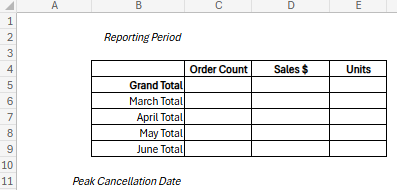
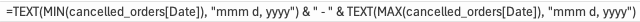
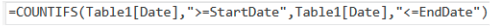
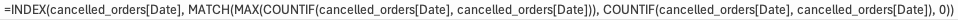

+++
title = "Spreadsheet Mastery Project: Part 2"
date = 2024-01-08T10:24:35-06:00
draft = false
weight = 2
+++

Your department director reviewed the different components that you created for the Mockup and liked the different options that you created. While your director was reviewing these options, the stakeholders requested an enhancement to the original specifications: additional detail about Cancelled Orders.

Your director sends you an email requesting that you mockup a Cancelled Order Summary page and a Cancelled Order Detail page and then resubmit the workbook for review.

## Your Plan

1. From PivotTable 1 of the Exercise solution, double-click the cell that holds the value for `Cancelled Order Count`. A new worksheet with a Table of data will pop out titled Detail1. Rename it "Cancelled Order Detail".
1. Using this new table of data, insert a PivotTable into a new worksheet in cell T2. Title the new worksheet "Cancelled Order Summary".
1. Build the new PivotTable so that the `Date` appears in rows and the `Order Count` appears in columns. Rename column headers to align with previous naming conventions.
1. Insert a line chart that displays the order count by day. Title the chart "Daily Cancelled Orders". Title the vertical axis "Order Count" and the horizontal axis "Date". Remove the legend.
1. Position the line chart to the left of the PivotTable, stretching the length of Columns A-S to make the most of the space on the worksheet.
1. Create a simple template above the line chart that looks like this image:

   

1. In cell C2, type this formula with the actual ranges to display the reporting period in a custom format.

   

1. Use the `SUM` formula and reference the PivotTable Range U3:U93 to populate the Grand Total cell for `Order Count`.
1. Now, filter the `Date` column of the PivotTable to display only 3/31/2022. What happens to the `Grand Total Order Count` that you just calculated? What happens to the line chart? Is this what you expected? Clear the filter from the PivotTable before moving on to the next step.
1. Delete the `SUM` formula that references the PivotTable range. You will need to reference the `Cancelled Order Detail` table to populate the summary grid with data that doesn’t update when users interact with the PivotTable.
1. Populate the `Cancelled Order Grand Total` using the `COUNTA` function on the `Order ID` column of the `Cancelled Order Detail` table.
1. Calculate the total orders for March by using the `COUNTIF` function on the `Cancelled Order Detail` table. Use the `COUNTIFS` function with logical operators to calculate the totals for April, May, and June. Your syntax will look similar to this.

   

1. Validate that the total order count for March, April, May, and June reconcile to the `Cancelled Order Total`.
1. Use the appropriate formulas to populate the`Sales $` and `Units` for `Grand Total`, `March`, `April`, `May`, and `June`. Validate that the totals reconcile to the `Grand Total` aggregates.
1. Lastly, find the `Peak Cancellation Date` using the nested formulas `INDEX`, `MATCH`, `MAX`, and `COUNTIF`. Type this out step by step to attempt to understand how the functions work together.

   

1. Does this date correspond to the `Peak Cancellation Date` displayed in the line chart?

Now that the basic Cancellation Summary and Detail pages are created, you send the workbook back to your director for additional review.

Upload the Microsoft Excel Workbook to Canvas under *Spreadsheet Mastery Project: Part 1* and click *Submit*.
