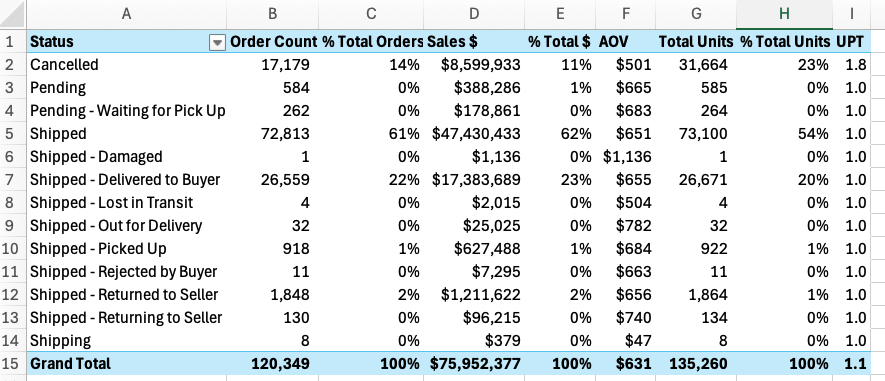

+++
title = "Spreadsheet Mastery: Exercises Part 2 - Order Summary Pivots"
date = 2024-01-08T10:24:35-06:00
draft = false
weight = 2
+++

## Scenario

The Order Summary Report that you submitted last week was well received by your department director and key stakeholders in external departments. The comprehensive analysis and clear presentation of the data helped stakeholders understand the current order patterns and shipping performance.

Building on this success, the stakeholders have requested interactive PivotTables to complement the static report. This will allow them to explore the data dynamically and answer ad-hoc questions without requiring additional reports. You schedule a meeting with your department director and interested parties to gather specific requirements for this enhancement.

## Requirements
1. In Microsoft Excel
1. Focuses on Shipping Status categories
1. One workbook with multiple worksheets, including:
   1. Summary Report for Total Reporting Period (as currently exists)
   1. PivotTables by previously defined categories 
   1. All KPI calculations included
   1. Category slicers
   1. Date timeline selector
   1. Related Charts and Graphs

The specifications focus on functionality rather than design aesthetics. The stakeholders know what information they want to access and how they want to interact with the data, giving you flexibility in the visual presentation. This leaves the design and implementation approach largely to your professional judgment.

You decide to create multiple PivotTable mockups to review with your department director before finalizing the components for the deliverable.

## Learning Objectives

By completing this exercise, you will:

- Create and customize PivotTables for dynamic data analysis
- Design interactive dashboard components with slicers and timelines
- Build PivotCharts that update dynamically with user selections
- Apply professional formatting and design principles to data visualizations
- Organize complex analysis across multiple worksheets

## Tasks

**Starting Point:** Use your completed Order Summary Report workbook from the previous exercise as the foundation for this analysis.

### 1. Set up the workspace:
   - Add a new worksheet named "Mockup" to your existing workbook
   - Ensure number formats and field header conventions align with your Summary Report
   - Build all initial components in this worksheet for organization

### 2. Create core PivotTables:

   - Create a comprehensive PivotTable showing `Order Count`, `Sales $`, `% TTL Orders`, `% TTL Sales $`, `AOV`, `Total Units`, `% TTL Units`, and `UPT by Status` (Status in rows, values in columns):

   

   - Test different layout options (values in rows vs. columns, status positioning) to determine optimal presentation
   - Create focused single-metric PivotTables: `Order Count by Status`, `Sales $ by Status`, `Unit Count by Status`
   - Build time-based analysis: `AOV by Date` (Date in rows, values in columns)
   - Create performance metrics table: `UPT by Status`
   - Generate percentage breakdowns: `% Total Orders`, `% Total Sales $`, and `% Total Units` by status

### 3. Develop advanced analysis components:
   - Create identical analysis using `Fulfillment_Status` instead of `Status`
   - Build hierarchical analysis combining `ship-service-level` and `Fulfillment_Status` 
   - Design cross-category analysis: `Order Count by Sales Channel` and `Status`
   - Build ranked analysis: `Sales $` with numerical ranking by `Status` (sorted largest to smallest)
### 4. Apply professional formatting:
   - Apply different PivotTable Styles to each component to explore design options for your final dashboard
   - Test various formatting approaches using PivotTable Styles and Options menus
   - Choose formatting that enhances readability and professional appearance

### 5. Organize components across worksheets:
   - Move each PivotTable to its own worksheet using the Move PivotTable function
   - Rename worksheets with descriptive numbers (1, 2, 3, etc.) that align with component purposes
   - This provides space for slicers, timelines, and charts while maintaining organization

### 6. Add interactive controls:
   - Add Category Slicers and Timeline Selectors to each PivotTable
   - Configure slicer connections to control only the PivotTable on the related worksheet
   - Apply custom formatting to slicers and timelines that complements each PivotTable's design
   - Test functionality to ensure PivotTables update correctly with different selections

### 7. Create dynamic visualizations:
   - Create a 2-D Pie Chart for Order Count analysis (display top 5 categories, sorted by Orders largest to smallest)
   - Build a Column Chart for Sales $ analysis (sorted by Sales $ from largest to smallest)
   - Design a Line Chart for AOV over time analysis (include trend line)
   - Focus on professional formatting: axis titles, labels, data labels for optimal readability
   - Test chart appearance with different slicer and timeline selections to ensure consistent quality

## Submission

Your department director has requested a status update on the component and style options you've developed for review before finalizing the dashboard approach.

**Deliverable:** Upload your Microsoft Excel Workbook to Canvas under *Exercises: Spreadsheet Mastery Part 2*.

**Before submitting, confirm:**
- All PivotTables display data correctly and update with slicer/timeline changes
- Formatting is professional and consistent across components
- Charts are visually appealing and complement their respective PivotTables
- Worksheets are properly organized and labeled
- Interactive controls (slicers/timelines) function as expected 
