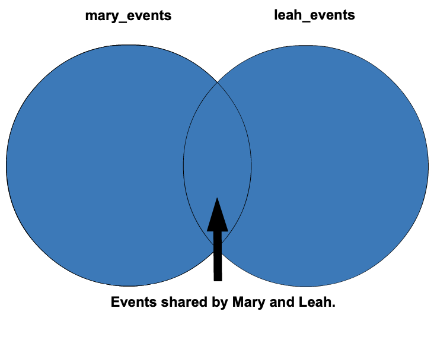

+++
title = "Full Outer Joins"
date = 2024-04-02T14:13:14-05:00
draft = false
weight = 4
+++

Finally, we have a full outer join. Joining two tables with a **full outer join** gives us a result set that
includes all records from both tables with null values for unmatched rows.

Now that another event planner has joined Mary's company, to get all of the
events run by the company in August, we can use a full outer join to combine
`mary_events` and `leah_events`.

```sql {linenos=table}
SELECT *
FROM mary_events
FULL OUTER JOIN leah_events ON mary_events.month = leah_events.month
WHERE mary_events.month = 08;
```



The Venn diagram above shows the result set highlighted in blue.

## Check Your Understanding

{}

What does a `FULL JOIN` do?

1. Returns results with matching rows in both tables
1. Returns results with all the rows from the left table with null values for unmatched rows from the right table
1. Returns results with all the rows from the right table with null values for unmatched rows from the left table
1. Returns results from all the rows from both tables with null values filled in for all unmatched rows

{}

<!-- 4 -->