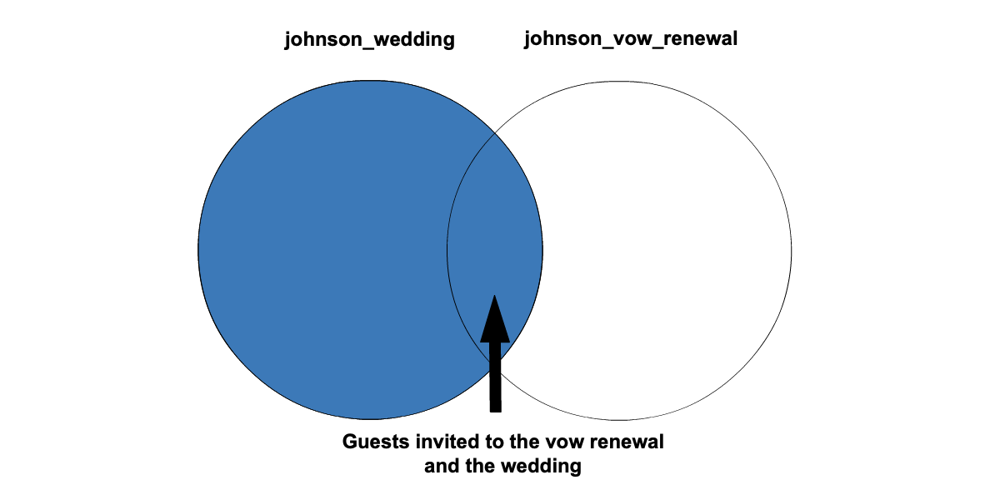
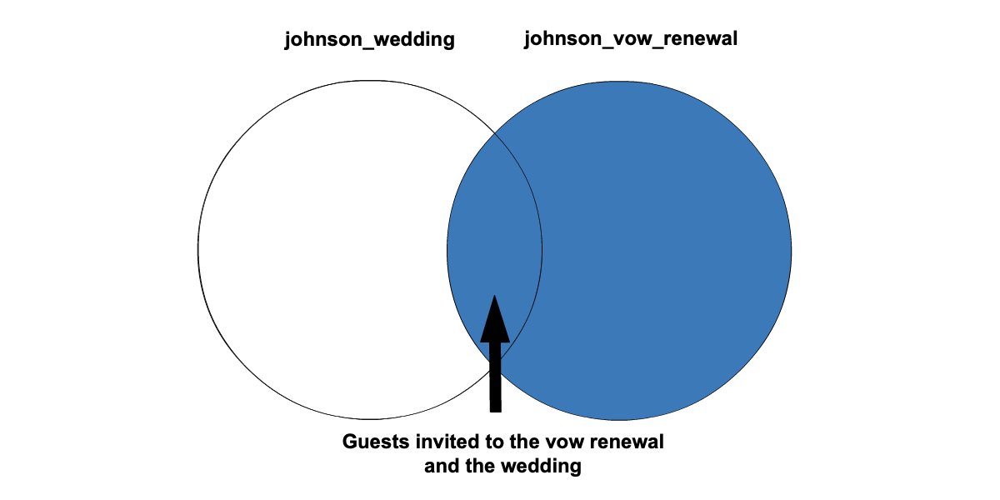

+++
title = "Left and Right Joins"
date = 2024-04-02T14:13:14-05:00
draft = false
weight = 3
+++

With different types of joins, we get different sizes of result sets. Inner joins are one of the most common joins you will see in SQL, however, with left and right outer joins, you can expand the result set to get more information if needed. 

## Left Outer Join

Between left and right outer joins, the left outer join is more common. Joining two tables with a **left outer join** gives us a result set which includes all values in the left table and any matching records from the right
table with null values for unmatched rows.

If we use a left outer join to combine `johnson_wedding` and `johnson_vow_renewal` in a query, the result set includes all of the guests invited to the wedding and any guests who were also invited to the vow renewal.

```sql {linenos=table}
SELECT last_name, first_name
FROM johnson_wedding
LEFT JOIN johnson_vow_renewal ON johnson_wedding.guest_id = johnson_vow_renewal.guest_id;
```



The Venn diagram above shows the result set highlighted in blue.

## Right Outer Join

Joining two tables with a **right outer join** gives us a result set that
includes all values in the right table and any matching records from the left
table with null values for unmatched rows.

If we use a right inner join to combine `johnson_wedding` and `johnson_vow_renewal` in a query, the result set includes all of the guests that were invited to the vow renewal and any guests who were also invited to the wedding.

```sql {linenos=table}
SELECT last_name, first_name
FROM johnson_wedding
RIGHT JOIN johnson_vow_renewal ON johnson_wedding.guest_id = johnson_vow_renewal.guest_id;
```



The Venn diagram above shows the result set highlighted in blue.

{}

One can argue that we could have gotten the same result set by switching which table was on the right and then doing a left join instead. This is one of the reasons why you might see a left join more often than a right. However, as you write different queries, you and your fellow analysts may find it helpful to stay consistent in what is considered the right table and what is considered the left.

{}

## Check Your Understanding

{}

In your own words what is the difference between a `RIGHT JOIN` and a `LEFT JOIN`?

{}