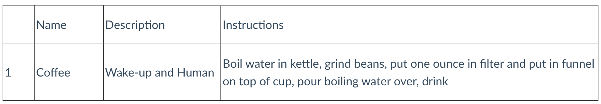

+++
title = "Create"
draft = false
weight = 2
+++

Previously, we outlined the four types of operations we can perform with SQL queries as CRUD. We have only done read operations so far with `SELECT` queries. Now we get to focus on operations that create new tables and add new records to existing tables.

## Creating Tables

The general syntax to create a new table starts with a `CREATE` statement and includes the names of the columns and their datatypes.

```sql {linenos=table}
CREATE TABLE schema_name.table_name (
   Column1Name column1datatype,
   Column2Name column2datatype,
   .
   .
   .
   ColumnNName columnndatatype
);
```

When creating new tables, you first want to sketch out what columns the table should have. Once you create your table, adding a column after the fact is not advisable. You really want to make sure that you know what that table needs to have before you run your query to create the table.

{}

Later on in your career, you may learn how to alter a table using the `ALTER TABLE` statement, but for now that is outside the scope of this class. To learn more, check out this article from [Microsoft](https://learn.microsoft.com/en-us/sql/t-sql/statements/alter-table-transact-sql?view=sql-server-ver16).

{}

Let's say that we work for a major grocery store chain and are part of the team evaluating the success of their rewards program. The database is called `FineFoods`, but the tables associated with the rewards program are going to be grouped together in a schema called `rewards`. As the rewards program rolls out, we want to track which in-app coupons were used by consumers in a table called `used_coupons` to determine what kinds of coupons we want to offer later.

Before we create `used_coupons`, we need to think about what data we want to store and what data type each column should be. To start, let's return to the business issue. The store wants us to analyze what coupons rewards customers used to figure out which coupons should be offered again and when those coupons should be offered. We need to know what the coupon was for, so we need to store the item's name, the manufacturer, the redeemable value of the coupon, and the category the item fell into. We need to know *when* those coupons were used too so we want to store the date when the coupon was used. Finally, we want to give each used coupon a unique identifier so we can easily connect this table to other tables later on. 

With all these factors in mind, here is our initial `CREATE` query to make this table.

```sql {linenos=table}
CREATE TABLE rewards.used_coupons (
   UsedCouponID int,
   ItemCategory varchar(255),
   Manufacturer varchar(255),
   ItemName varchar(255),
   RedeemableValue double,
   RedeemedDate date
);
```

While this is a good place to start, we want to make `UsedCouponID` a primary key and add a foreign key to the `coupons` table, so we can count how many times a specific coupon was used. Time to refine our query before we run it!

### Setting Up Primary and Foreign Keys

We want `UsedCouponID` to be a primary key. Furthermore, to make our lives easier, we want to make the primary key automatically increment. That way, the first item added to the table will automatically be given a `UsedCouponID` of 1, the second one will have a `UsedCouponID` value of 2, and so on. Let's alter the column declaration in the `CREATE` statement above.

```sql
UsedCouponID int IDENTITY(1,1) PRIMARY KEY
```

Here, we use the `IDENTITY(x,y)` keyword to designate that SQL Server needs to auto-increment starting at `x` and increasing by `y`. `IDENTITY(1,1)` means that SQL Server should start with a primary key of 1 and increase by 1.

Now we can add a foreign key column called `CouponID` that references the primary key column called `CouponID` in a table called `coupons` table.

```sql
CouponID int FOREIGN KEY REFERENCES coupons(CouponID)
```

If we add a primary key and a foreign key to our table, then our `CREATE` statement would now look like:

```sql {linenos=table}
CREATE TABLE rewards.used_coupons (
   UsedCouponID int IDENTITY(1,1) PRIMARY KEY,
   CouponID int FOREIGN KEY REFERENCES coupons(CouponID),
   ItemCategory varchar(255),
   Manufacturer varchar(255),
   ItemName varchar(255),
   RedeemableValue double,
   RedeemedDate date
);
```

### Temporary Tables

**Temporary tables** or temp tables are often used when you may not have certain permissions on a database but need to run queries in your everyday work. Only you can see the temp table you create in the connection you created it in. You cannot access the temp table from another workspace/window/notebook. When you close the connection the table has been created in, it’s automatically deleted.

You can make a temporary table by adding a hashtag in front of the table name. If we wanted to make a temporary table for the rewards program for just ice cream coupons, we would run the following query.

```sql {linenos=table}
CREATE TABLE #IceCreamCoupons (
   IceCreamCouponID int,
   ItemName varchar(255)
);
```

## Adding Records

With our table set up, we can add a new record using the `INSERT` statement. When adding a new record, we can use the following general syntax:

```sql {linenos=table}
-- Inserting a record with values for each column in the table

INSERT INTO schema_name.table_name
VALUES (Column1, Column2, ..., ColumnN);

-- Inserting a record with values for some of the columns in the table

INSERT INTO schema_name.table_name (Column2Name, Column5Name, ...)
VALUES (Column2, Column5, ...);
```

If we wanted to add a new coupon for candy to the `used_coupons` table, we would write the following:

```sql
INSERT INTO rewards.used_coupons (CouponID, ItemCategory, Manufacturer, ItemName, RedeemableValue)
VALUES (276, 'candy', 'Trolli', 'Sour Brite Crawlers', 1.00);
```

We do not have to specify the primary key column because we set that column auto-increment so SQL Server will add a value for that column automatically. In the above query, since we do not have a redeemed date for this coupon, that value will remain `NULL` for now.

## Check Your Understanding

{}

Which of the following queries would you use to create a table called recipes, that holds name (up to 25 characters), description (up to 50 characters), and instructions (up to 500 characters). 

1. ``` sql
   CREATE TABLE schema_name.recipes(
      name VARCHAR(25),      
      description VARCHAR(50),      
      instructions VARCHAR(500),
   );
   ```

1. ```sql 
   MAKE TABLE schema_name.recipes(
      name VARCHAR(25), 
      description VARCHAR(50), 
      instructions VARCHAR(500),
   );
   ``` 

1. ```sql
   CREATE TABLE schema_name.recipes(
      name,
      description,
      instructions,
   );
   ```

1. ```sql
   CREATE TABLE schema_name.recipes(
      name (25),
      description (50),
      instructions (500),
   );
   ```

{}

<!-- 1 -->

{}

Which of the following queries would add information into the `Recipes` table below.


   
1. ```sql
   INSERT INTO schema_name.Recipes (name, description, instructions)
   VALUES('Pizza', 'To lazy to cook but hungry', 'Call ModPizza and order for delivery');
   ```

1. ```sql
   ADD ROW schema_name.Recipes (name, description, instructions)
   VALUES('Pizza', 'To lazy to cook but hungry', 'Call ModPizza and order for delivery');
   ```

1. ```sql 
   INSERT INTO schema_name.Recipes (2, name, description, instructions)
   VALUES('Pizza', 'To lazy to cook but hungry', 'Call ModPizza and order for delivery')
   ```

1. ```sql
   ADD ROW schema_name.Recipes (2, name, description, instructions)
   VALUES('Pizza', 'To lazy to cook but hungry', 'Call ModPizza and order for delivery')
   ```

{}

<!-- 1 -->