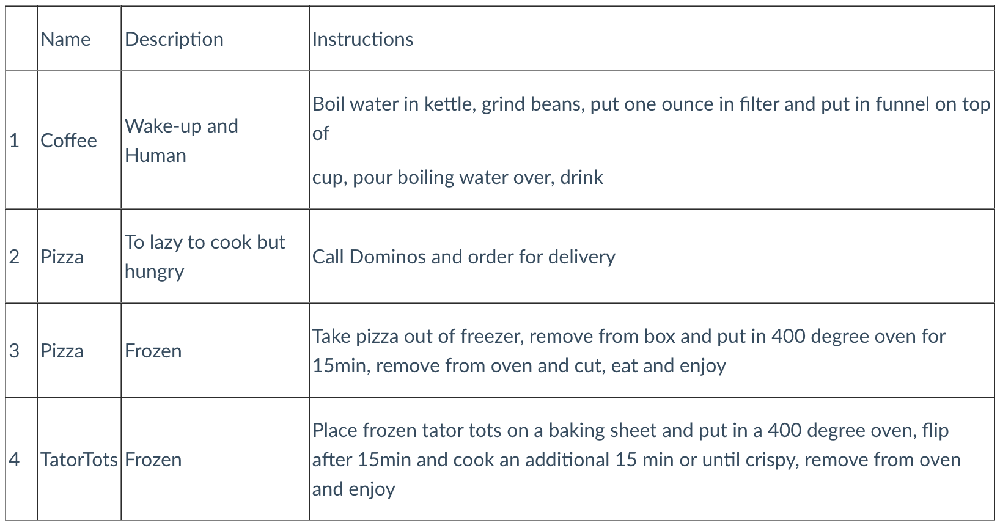

+++
title = "Delete"
draft = false
weight = 4
+++

Finally, we can remove both records and tables as part of the delete in CRUD. Let's dive back into the grocery store rewards program to learn how to do so! Removing any data in SQL Server is a permanent change and the data cannot be recovered so practice is key!

## Delete a Row

`DELETE` statements include a `WHERE` clause so that we can specify what condition must be met in the data we want to remove.

```sql
DELETE FROM schema_name.table_name WHERE condition met;
```

In the case of the rewards program, we have learned that clear Pepsi was discontinued and we need to remove the record for used coupons for that product from our table. Clear Pepsi has a `CouponID` of 13, so we would write our query like so:

```sql
DELETE FROM rewards.used_coupons WHERE CouponID = 13;
```

Typically, when you write a query like this, SQL Server will output how many rows were affected. If you want to run a check before you delete records from the table, you could use your aggregate functions to see how many rows *should* be affected and compare the two numbers upon deletion to make sure that all rows were removed.

## Delete a Table

If we ever got rid of the app and wanted to remove all records of in-app coupon usage, we could run the following query:

```sql {linenos=table}
DROP TABLE rewards.used_coupons
```

When dropping tables, we want to ensure that we don't have any existing connections to other tables. If `UsedCouponID` is used as a foreign key in another table, we would need to first sever that connection before we can drop a table.

{}

If you are curious on how to get rid of a foreign key referencing a table you want to drop, you should check out this [article](https://www.w3schools.com/sql/sql_ref_drop_constraint.asp) on `DROP CONSTRAINT`.

{}

## Check Your Understanding

{}

Write a query to delete any records with a `Description` of Frozen from the `Recipes` table below.



{}

{}

Which of the following queries will delete the entire `Recipes` table?

1. `DROP TABLE schema_name.Recipes;`
1. `REMOVE TABLE schema_name.Recipes;`
1. `FROM schema_name DROP TABLE Recipes;`
1. `DELETE TABLE schema_name.Recipes;`

{}