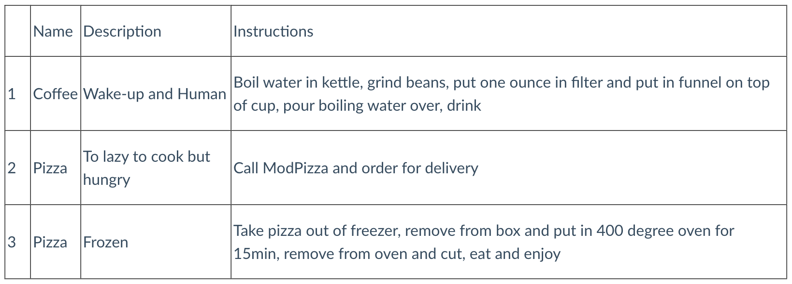

+++
title = "Update"
draft = false
weight = 3
+++

With our tables made and filled with lots of data, we can update records within a table using this general syntax.

```sql {linenos=table}
UPDATE schema_name.table_name
SET Column = NewValue
WHERE condition met;
```

The `UPDATE` statement allows us to specify what the new value for a column should be as long as a certain condition is met. That's see how this could work with our employer's rewards program.

Now that we have set up a table for the coupons used by our app consumers, we may want to edit something. We have a record for a coupon for 50 cents off a package of Del Monte corn. Now when the record was created, the `Category` value was set to `'Frozen Foods'`. Upon an audit of our data, we have discovered that the coupon was not for Del Monte *frozen* corn, but for Del Monte *canned* corn. Using an `UPDATE` statement, we can change the value of `Category` to what it should be.

```sql {linenos=table}
UPDATE rewards.used_coupons
SET Category='canned goods'
WHERE CouponID = 143;
```

Now the value of `Category` is changed for all records where the `CouponID` value is 146.

## Check Your Understanding

{}

Write a query to update the second recipe's `Instructions` to call Dominos instead in the `Recipes` table below.



{}
