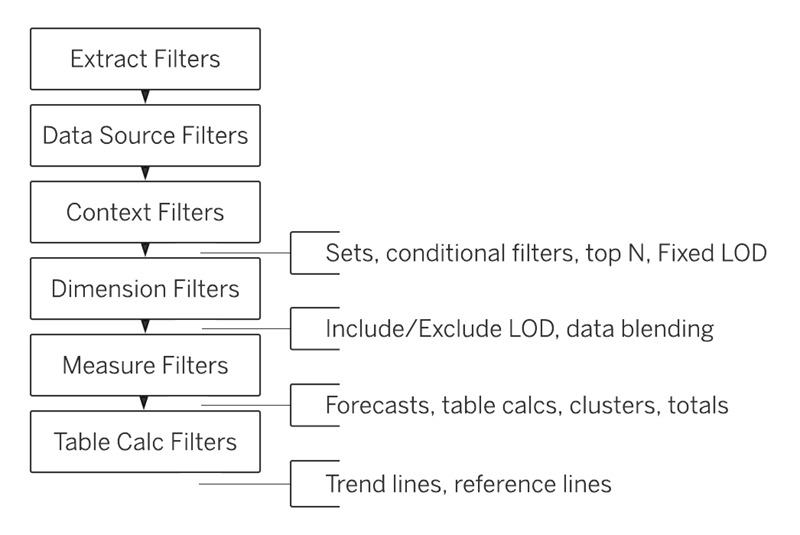

+++
title = "Filtering and Sorting"
date = 2021-10-01T09:28:27-05:00
draft = false
weight = 1
+++

Previously, we talked about [keeping it simple]({}) in Chapter 17 when we introduced data visualization best practices. Because we are using Tableau to put together our dashboards and stories as part of presenting our findings, we want to make sure that we are following best practices and only displaying the data we really need to. This is where data preparation comes in. Tableau has a number of features that we will explore throughout this chapter to keep our visualiations clean.

Throughout the previous chapters on cleaning data, we talked about removing unnecessary data, however, filtering data is for when we want to keep the data, but there is too much data on the visualization. Tableau gives us a number of different ways we can filter our data, but in order for our filters to work, we have to pay attention to the type of filter we are using and the order in which Tableau will apply these filters.

## Tableau's Order of Operations

Tableau follows an order of operations, also known as the **query pipeline**. 

1. Extract filters
1. Data source filters
1. Context filters
1. Dimension filters
1. Measure filters
1. Table calculations

Within each of the categories in the query pipeline, there are subcategories, so you may find this diagram helpful as you move through this and the following chapters.

*Image courtesy of [Tableau](https://help.tableau.com/current/pro/desktop/en-us/order_of_operations.htm)*

Let's review what each of these categories mean. 

An **extract filter** is a filter applied to the extract of the data source or where the data originally comes from. If you work for an online retailer that specializes in jewelry and want to analyze earrings sales for the past 6 months, you may start by pulling in the data into Tableau from SQL Server. However, if you already know that you only need the data from the past 6 months, you may apply an extract filter to remove any data from before then.

Once you load the data into Tableau, the data is known as the data source. A **data source filter** is a filter applied to the data source before a visualization needs to be made. You will find it very helpful when visualizing data to first review your data source and think hard about what you do and do not need. In the case of earrings sales, you might realize that the actual dimensions of the earrings are not as important as the category so you can apply a data source filter before you begin working on your visualizations.

A **context filter** and a **dimension** filter come into play with the order of operations. Both of these filters will remove rows and columns to alter the structure of the table. The context filter comes first in the order of operations and performs its action *before* the data is loaded and a dimension filter will perform its action *after* the data is loaded. Because of this, you may find a context filter handy if your data is taking a long time to load.

**Measure filters** remove specific cells that don't match a given condition. In the case of analyzing earring sales, you may want to perform some visualizations based on the price of the earrings sold. You can use a measure filter to only visualize earrings that are priced between $50 and $100.

Finally, we have **table calculations**. We will be covering table calculations in a later chapter, so for now, you just need to know that table calculations allow you to convert values in a table to suit your needs.

{}

You may not need all of these filter types immediately, but we want to drive home the order of operations now so you do not get tripped up later.

{}

## Adding Filters to Tableau

You can apply filters in a few different ways. The main method involves dragging measures to the Filter shelf and selecting the correct options from the dialog box.

## Sorting Data

Sorting data can help make the visualization easier to read for your viewers. Sometimes you can just hover over the axis and click on the sort icon to change how the visualization is sorted. You can also sort your dimensions from the toolbar by selecting the field you want to sort and then clicking the appropriate sort icon.