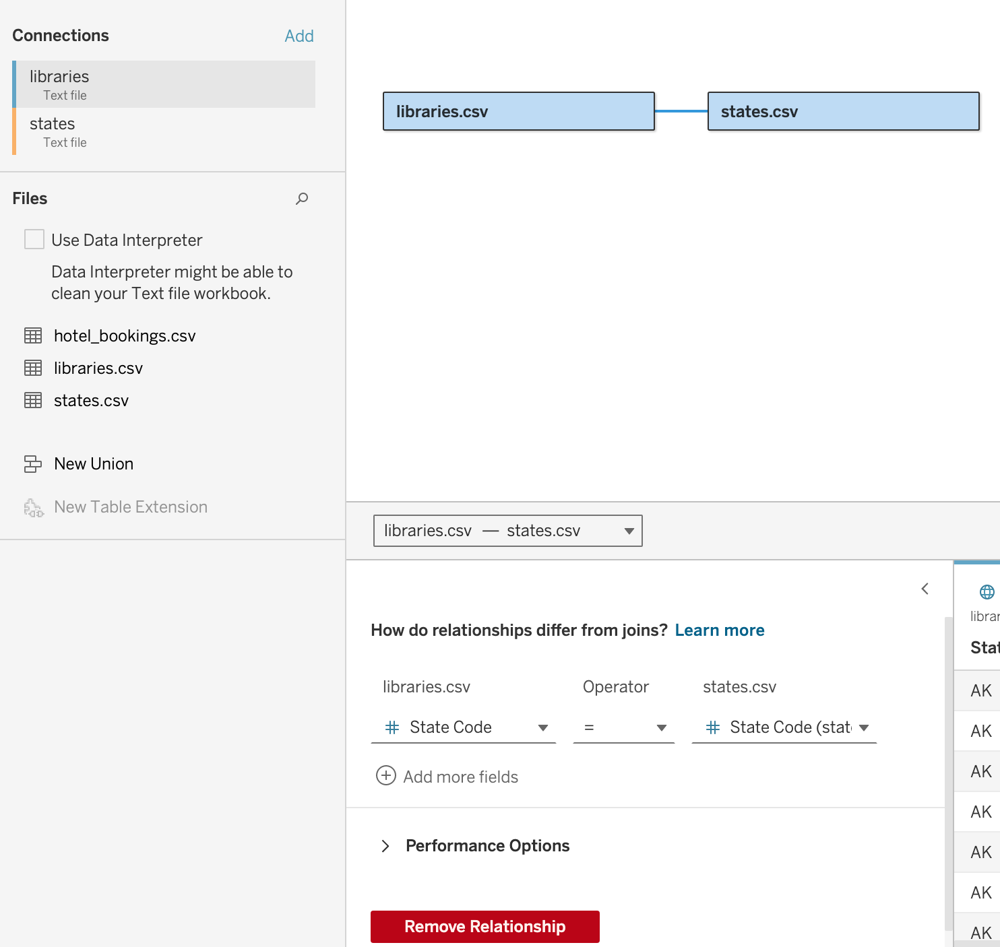

+++
title = "Studio: Data Preparation"
date = 2021-10-01T09:28:27-05:00
draft = false
weight = 3
+++

## Getting Started

**Due to the size of the dataset we are using, please use the Desktop version of Tableau Public for these exercises.** 

**You can publish a local Tableau workbook to your Tableau Public account by selecting the 'File' dropdown menu in the app toolbar, and then selecting the 'Save to Tableau Public' option.**

**Please make sure to save your local workbook often when using the Desktop version of Tableau Public. You only need to 'Save to Tableau Public' when you finish the exercises and are ready to submit your work.**

### Background

The dataset used in this studio was created by the Institute of Museums and Library Services (IMLS).  We 
will be exploring data from Fiscal Year 2014.  Documentation of this survey can be found [here](https://www.imls.gov/sites/default/files/fy2014_pls_data_file_documentation.pdf) if you would like to learn more about it. The survey collected data for each state and the District of Columbia.

### Working Through the Studio

You will be placed into one of eight groups.  The group number reflects the region you have been assigned in the table below.  As a team, one group member can be in charge of Tableau and screen share while other group members provide direction and suggestions.  At the end of the studio, you will present your favorite chart or final dashboard to the class as a whole.

While this is a group assignment, it is recommended for your own portfolio that you make your own version of this studio.

### Setting Up the Studio

Download the [library data set](https://www.kaggle.com/imls/public-libraries?select=libraries.csv%C2%A0). There are 2 CSV files. To download all CSV files at once, click on the "Download" bubble next to the "New Notebook" bubble at the top of the Kaggle Page.

1. Open the CSV file in Tableau Public.  

   1. It is a larger file than we have previously used and may take a few minutes to open. 

1. When you open this data set, you will want to create a relationship between the `libraries.csv` file and the `states.csv` file using the 'State Code' field.

1. Part 1 invites you to briefly explore the data set.  You will explore all the regions of the US.
1. In Part 2, using your assigned region, you will be asked to answer questions using a set.
1. In Part 3, you will select 2 (or more) of your favorite charts and create a dashboard that highlights results from your selected region.
1. The final outcome of this studio will include 8 worksheets (9 if you do the bonus) and 1 dashboard.
  
| **US Regional Codes Table** | **State Names and Abbreviations** |
|-----------------------------|-----------------------------------|
| Region Code 1 - New England | Maine (ME), New Hampshire (NH), Vermont (VT), Massachusetts (MA), Connecticut (CT), Rhode Island (RI) |
| Region Code 2 - Mideast | New York (NY), Pennsylvania (PA), Maryland (MD), New Jersey (NJ), Delaware (DE), Washington DC (DC) |
| Region Code 3 - Great Lakes | Wisconsin (WI), Illinois (IL), Indiana (IN), Michigan (MI), Ohio (OH) |
| Region Code 4 - Plains | Missouri (MO), Kansas (KS), North Dakota (ND), South Dakota (SD), Minnesota (MN), Iowa (IA), Nebraska (NE) |
| Region Code 5 - Southeast | Virginia (VA), West Virginia (WV), North Carolina (NC), South Carolina (SC), Georgia (GA), Florida (FL), Alabama (AL), Mississippi (MS), Louisiana (LA), Arkansas (AR), Tennessee (TN), Kentucky (KY) |
| Region Code 6 - Southwest | Arizona (AZ), New Mexico (NM), Oklahoma (OK), Texas (TX) |
| Region Code 7 - Rocky Mountain | Idaho (ID), Montana (MT), Wyoming (WY), Colorado (CO), Utah (UT) |
| Region Code 8 - Far West | Alaska (AK), Washington (WA), Oregon (OR), California (CA), Nevada (NV), Hawaii (HI) |

[Source](https://www.bea.gov/news/2015/gross-domestic-product-state-advance-2014-and-revised-1997-2013/regional-maps)

## Part 1: EDA

**Use data from the states.csv table unless otherwise noted.**  

In this section, we will be looking at the overall nationwide data. 
Use the US Regional Codes Table above to create a group for each region using the `State` field. 

Create a viz for each of the following questions: 

1. How many library visits occurred in each region? 
   Then, how do library visits compare to circulation transactions for each region?

1. Compare Library Programs against State Population for each region.
   **Try something other than a bar chart.**
   1. Explore the marks card. Add at least one feature.

1. How many library visits are there for each region compared by End Date? 
   Use the End date from the `libraries.csv` file. 
   Pull other elements from the `states.csv` file. 
   Hide the `Null` values in your final viz.
      

## Part 2: Collect Your Data

Begin working with your assigned region. Remember to use the table above to help with managing and organizing your data and use data from the `states.csv` table unless otherwise noted.

Create a collection to hold your data:

1. Using the groups created in Part 1, create a set that only includes your group's region. Change the set to 'Show members in Set' from the dropdown menu for the field. Rename the set to match your region's name.

**Questions to Answer with a Viz**

Now that you have organized your data, you are ready to explore your region.

Create a new worksheet for each question. Answer them using your set and the overall regions (when necessary).

1. How many Central Libraries vs Branch Libraries are in each state within your region? Then, add in how many bookmobiles are in each state in your region.

1. How many Young Adult (YA) library programs does each state in your region host and how many individuals attend?

1. For Central Libraries and Branch Libraries in your region, how many employees are Librarians?

1. How many Librarians hold an MLS degree in your region compared to the rest of the US? Then, compare the number of librarians that hold an MLS degree to the number of total staff for your region and the rest of the US.

1. How do circulation transactions compare between your region and the rest of the US over 2013-2014?

   1. Hint: Use the End Date pill.  Hide any Null values, we only want reported values at this time. 

## Part 3: Create a Dashboard

Create a dashboard that highlights at least 2 of your favorite charts from the studio.  (The bonus can be one of these).

## Bonus Mission

Using the `libraries.csv` file, create a map viz to answer the following question:

1. For each county for a specific state in your region, what was the total audience for Young Adult Programs?
 

## Finishing Touches

Before you turn in your vizzes:

1. Make sure they are easy to read. 
1. Review and edit any axes so that they don't contain the file name information. 
1. Make sure any filtering, group, or set information is easy to understand. 

   1. For example, when using a set, the predefined labels may say “In” and “Out”. Would extra context make them easier to understand? 
   1. Don't forget to title your charts.  

1. If you want to explore fonts and colors, go right ahead. 

   1. Feel free to change the colors of any/all of your charts.  

## Submitting Your Work

When finished, make sure to save and publish your work to your Tableau Public account. Copy the URL to your published Tableau project and paste it into the submission box in 
Canvas for **Studio: Visualization with Tableau Part 2** and click *Submit*.
